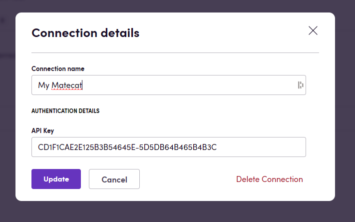

# Blackbird.io Matecat

Blackbird is the new automation backbone for the language technology industry. Blackbird provides enterprise-scale automation and orchestration with a simple no-code/low-code platform. Blackbird enables ambitious organizations to identify, vet and automate as many processes as possible. Not just localization workflows, but any business and IT process. This repository represents an application that is deployable on Blackbird and usable inside the workflow editor.

## Introduction

<!-- begin docs -->

Matecat is a free online CAT tool by Translated.

## Before setting up

Before you can connect you need to make sure that:

- You have a Matecat API key. See [this article](https://guides.matecat.com/obtaining-api-credentials) on how to obtain API credentials.

## Connecting

1. Navigate to apps and search for Matecat. If you cannot find Matecat then click _Add App_ in the top right corner, select Matecat and add the app to your Blackbird environment.
2. Click _Add Connection_.
3. Name your connection for future reference e.g. 'My Matecat'.
4. Enter your Matecat [API key](https://guides.matecat.com/obtaining-api-credentials).
5. Click _Authorize connection_.

## Actions

See the [Matecat API documentation](https://www.matecat.com/api/docs#/) for a detailed explanation on each action.

### Projects

- **Create project** creates a new project in detached mode.
- **Get project**.
- **Cancel project**.
- **Archive project**.
- **Activate project**.

### Jobs

- **Download translation as ZIP** returns a ZIP file that includes all the translated files.
- **Download translation** returns multiple seperate translated files of this job.
- **Download job TMX** returns the TMX file representing the current status of the job.
- **Get job segments comments** returns a list of all comments that have been made in this job.
- **Get job**.
- **Cancel job**.
- **Archive job**.
- **Activate job**.

### Teams

- **List teams**.
- **Create team**.
- **List team projects**.
- **List team members**.
- **Add members**.
- **Remove member**.

### Translation issues

- **Get translation issue**.
- **Create translation issue**.
- **Delete translation issue**.
- **Get translation issue comments**.

### Glossaries

- **Import glossary**. You can optionally specify an existing Translation Memory (TM) key, and the TM will be updated with the provided glossary. Glossaries can only be imported as private TMs in Matecat. More details on glossary import specifics in Matecat can be found [here](https://guides.matecat.com/how-to-add-a-glossary).

## Missing features

- Translation Versions
- Quality report
- Project merging

Let us know if you are interested in these features!

## Feedback

Feedback to our implementation of Matecat is always very welcome. Reach out to us using the [established channels](https://www.blackbird.io/), or create an issue.

<!-- end docs -->
